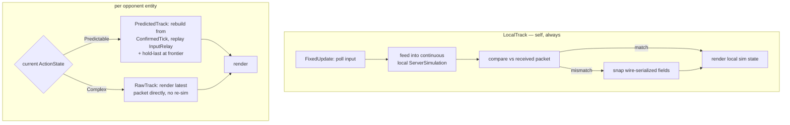

# Rollback Netcode — Design

**Date:** 2026-08-02 (scope revised 2026-08-03 — grilling session, see ADR-0011)
**Status:** Spec complete, implementation pending go. Output of the grill-with-docs session (triage → grilling → domain-modeling).
**Tracks:** PvP roadmap v2 Phase 7 (`docs/plans/2026-08-01-pvp-roadmap-v2.md`), `docs/systems/netcode-architecture.md` §6/§10, ADR-0010, ADR-0011.
**Glossary:** `CONTEXT.md` § Prediction & Rollback — ConfirmedTick, RollbackWindow, InputRelay, LocalTrack, PredictedTrack, RawTrack, Predictable/Complex ActionState.

## Goal

Kill input lag in online matches. The client currently renders raw server state ("one-tick display latency is intentional (Phase 1)"), which at internet RTT (20–100ms = 1–6 ticks) makes movement and hit reactions feel floaty. Rollback gives every client instant local response while the server stays authoritative: predict locally, correct when the authoritative state disproves the prediction.

Demo context: v0.2.0-demo.1 is live with an official server (SlopArena EU #1, `sloparena.barakaslurp.fr:7777`); the friends playtest is the first real internet-latency audience — exactly the regime this design exists for.

## Decisions

| # | Decision | Rationale / evidence |
|---|---|---|
| D1 | **Three-track model**: LocalTrack (self, always continuous) + PredictedTrack (opponents, Predictable ActionState only) + RawTrack (opponents, Complex ActionState — no re-sim) | Uniform all-entity rebuild-and-replay (original D1) is unimplementable: `CharacterStatePacket` drops most of `CharacterState`, and per-ability-instance fields + `SpellResolver`'s hitbox/projectile list are never serialized anywhere. Self doesn't have this problem (true continuous inputs, never rebuilt); opponents only get prediction where it's actually safe. See ADR-0011. |
| D2 | **InputRelay** — server appends each entity's consumed input (or no-input marker) to the broadcast | The client has no other source of opponent inputs; the protocol is state-only today. Feeds PredictedTrack only — LocalTrack uses the player's own true input buffer. |
| D3 | **PredictedTrack rebuilds** from ConfirmedTick on every state batch (input ring buffer + confirmed base, no predicted-state ring); **LocalTrack never rebuilds** — runs continuously from match start, corrected by snap on mismatch | Rebuild-and-replay assumed a full-state snapshot that doesn't exist on the wire. Self doesn't need rebuilding since it already has true continuous input history — this is standard client-side prediction (Source-engine style), not GGPO-style peer rollback; only opponents need the snapshot mechanism at all. |
| D4 | Corrections **snap** (no blend) | Platform-fighter convention. Corrections are frontier-only and small; blend adds renderer state and rubber-band smear. |
| D5 | Frontier guess: **hold-last** (PredictedTrack only) — a *feel* decision | The server drops→neutral on empty queues (`MatchInstance.cs:353-355` gates on `IsEliminated`/`Disconnected`; `ServerSimulation.cs` → `default(InputState)`), so no consistency argument exists. Hold-last minimizes divergence for continuous movement; neutral stalls constantly. RawTrack entities have no frontier guess — Complex states render the latest packet directly, nothing to guess. |
| D6 | Local sim runs the **same rule** (`StockMatchRule`, same stocks); **MatchState UI snaps** from the server packet | KO/respawn/elimination prediction must match the server; lifecycle UI is 1 byte @60Hz — nothing to predict. |
| D7 | Rollback core lives in **`src/Shared` as a pure C# `RollbackSimulator`** owning all three tracks (LocalTrack's continuous sim, PredictedTrack's rebuild-and-replay, RawTrack's pass-through); **`RollbackSimulationBridge`** is a thin Unity adapter — third `ISimulationBridge` impl. PvP switches to it, Training keeps `LocalSimulationBridge`. | Puts the whole algorithm at the one testable seam (`tests/Shared.Tests`), so the golden-tick determinism suite can exist per-track; the bridge stays a thin adapter. Everything the core needs is already Shared (`ServerSimulation`, `ArenaDefinition`, `CharacterDefinition`, `InputState`, `IMatchRule`). |
| D8 | **Golden-tick determinism test** (per track) + **simulated delay/loss harness** | Determinism is the whole game — prove byte-identical re-sim (LocalTrack + PredictedTrack) or nothing works. |
| D9 | **Predictable/Complex ActionState partition**: `Idle`/`Dashing`/`JumpSquat`/`AirDodging` = Predictable (PredictedTrack-eligible); `Attacking`/`Hitstun`/`Warping` = Complex (RawTrack only) | Predictable states depend only on fields the (widened) wire carries. Complex states depend on the `ServerAbility` instance layer and `SpellResolver`'s hitbox/projectile list, which stay server-memory-only, out of scope. `Sliding` is unused dead code in `Simulation.cs` — not a member of either partition. |
| D10 | **Widen `CharacterStatePacket`** with ~12 movement-resource fields (`AirTimeTicks`, `DashDurationTicks`, `DashDirX/Z`, `DashCooldownTicks`, `AirDodgesLeft`, `JumpsLeft`, `InvincibilityTicks`, `TurnaroundTicks`, `DirHoldTicks`, `IsSprinting`, `LastDirX/Z`, `WasAirborneDuringKnockback`) — ~30B/entity | Predictable states secretly depend on these — e.g. `Dashing`'s own decel logic gates on `DashDurationTicks`/`DashDirX/Z`, and `AirTimeTicks` drives the fall-ramp gravity curve for every airborne entity. Without them, PredictedTrack re-sim isn't actually byte-identical. Cheap: no ability/hitbox serialization needed. Bandwidth ~76KB/s @ 10 entities; `MatchInstance.SendState()` already sends one UDP datagram per entity (not batched), so this stays far under fragmentation limits regardless of entity count. |

### Corrections landed during review
- Relay payload is **19B** (`InputState.Size = 19`, `InputState.cs:38`), not 31B — the 31 includes entityId+tick which do not re-travel.
- Own-entity input source on own-packet loss: client replays **its own input buffer**, never the relayed (held) input — the instant-input promise is the point of this work. Divergence is ≤2 ticks and snap-corrected. (Server holds last and discards late ticks via `clientTick <= _serverTick`, `MatchInstance.cs:276`.)

### Resolved during grilling (2026-08-03) — see ADR-0011
The uniform "predict all entities via confirmedBase rebuild" mechanism (original D1/D3) does not survive contact with the actual wire protocol and ability architecture: `CharacterStatePacket` serializes ~24 of `CharacterState`'s ~40 fields, and `ServerAbility` instance state (e.g. `NilusVoidRift._seedSpawned`, `_cachedAimYaw`) plus `SpellResolver`'s live hitbox/projectile list are server-memory-only, never serialized anywhere. Resolved into three tracks (D1/D9/D10 above): **LocalTrack** for self (continuous, never rebuilt — sidesteps the problem entirely), **PredictedTrack** for opponents in a Predictable ActionState (rebuild-and-replay, now safe once the wire is widened per D10), **RawTrack** for opponents in a Complex ActionState (no re-sim, render latest packet — identical to today's Phase 1 for that entity). This also corrects ADR-0010's rejection rationale for self-only prediction ("opponent hit reactions would land late") — that's true regardless under this design too, since `Hitstun` is Complex/RawTrack. PredictedTrack is kept for the narrower, still-real win of smooth opponent *movement*, not instant hit reactions.

## Wire format

### Downlink, per entity (was 75B pre-relay, 95B with InputRelay — issue #80, shipped)
```
[0..7]   entityId          (8)
[8..11]  tick              (4)   ← _serverTick, in client-tick space (verified: MatchInstance.cs:342, 395, 400)
[12..74] CharacterStatePacket (63, current)
[..]     movement-resource fields (D10) — ~12 fields, ~30B: AirTimeTicks, DashDurationTicks,
         DashDirX/Z, DashCooldownTicks, AirDodgesLeft, JumpsLeft, InvincibilityTicks,
         TurnaroundTicks, DirHoldTicks, IsSprinting, LastDirX/Z, WasAirborneDuringKnockback
[..]     hasInput          (1)   ← 0x01 = relayed InputState follows; 0x00 = no input this tick
[..]     InputState        (19)  ← present iff hasInput
```
- **hasInput = 0** means the server's queue for that entity was empty that tick (or the entity is eliminated): the client must *omit* the entity from its re-sim inputs dict, reproducing the server's `default(InputState)` path exactly.
- Max ~106-127B/entity (exact layout depends on whether the D10 fields land in `CharacterStatePacket` itself or a parallel struct) → **~76KB/s down** @ 10 entities × 60Hz. Uplink unchanged (31B). Per-entity datagrams (`MatchInstance.SendState()` sends one per entity, not batched) stay far under UDP fragmentation limits (~1472B safe ceiling) regardless of entity count.
- **LocalTrack (self) doesn't consume the confirmedBase snapshot at all** — it only uses the wire-serialized fields to check for a mismatch and snap-correct. The D10 fields matter only for PredictedTrack's rebuild-and-replay of opponents.

### The reconciliation anchor
The tick field already works — no server change needed beyond the relay + D10 widening. Verified: `SendState()` writes `_serverTick` to both the envelope and `CharacterStatePacket.TickNumber`; `_serverTick = max(_serverTick, input.tick)` runs in client-tick space.

## Client architecture



`RollbackSimulator` (`src/Shared` — the tested core) owns three sub-mechanisms, not one:
- **LocalTrack**: a persistent `ServerSimulation` for the self entity, fed `ownInputBuffer` every tick, never torn down or rebuilt. Correction = compare its computed `CharacterState` against the received packet's wire-serialized fields; snap those on mismatch (D4). Matches `LocalSimulationBridge`'s existing Training-mode pattern.
- **PredictedTrack**: per opponent entity currently in a Predictable ActionState — `confirmedBase` (widened per D10) + rebuild-and-replay via `InputRelay`, hold-last at the frontier (D5).
- **RawTrack**: per opponent entity currently in a Complex ActionState — no sim state at all, just the latest received `CharacterState` (today's Phase 1 behavior for that entity). An entity switches PredictedTrack ↔ RawTrack the tick its `ActionState` crosses the Predictable/Complex boundary (D9).
- gap absorption + window cap (30 ticks) — PredictedTrack only; LocalTrack has no window (never rebuilds) and RawTrack has no window (never predicts).

`RollbackSimulationBridge` (`client/Unity/Assets/Scripts/Runtime/Simulation/` — thin adapter):
- feeds polled input into LocalTrack's own buffer; decodes received batches (state + relay) into PredictedTrack's confirmed base and RawTrack's latest-state cache; renders whichever track owns each entity this tick;
- setup parity with `MatchInstance`: same registration order (roster order), same defs + baked data, same respawn positions, same rule (D6).

Server (`MatchInstance.SendState`): append the relay section per entity from the per-slot input actually consumed (unchanged, issue #80); add the D10 movement-resource fields to the state packet. Nothing else changes — no ability-instance or hitbox-layer serialization (explicitly out of scope, see below).

## Determinism contract

Two separate mechanisms, two separate correctness arguments:

**LocalTrack (self):** never rebuilt, so it can only diverge from the server's true state via non-determinism in the shared sim itself — floating-point drift between the client runtime (Mono/IL2CPP) and the server runtime (CoreCLR) is the one real residual risk here, not otherwise addressed by this plan (worth a canary golden-tick run through IL2CPP before trusting silence on it). Corrected by snapping the wire-serialized fields whenever the server packet disagrees — small, self-healing regardless of the drift's cause.

**PredictedTrack (opponents, Predictable states):** reproduces the server's states exactly **iff** input knowledge is identical and the widened wire (D10) is complete for those states. Divergence sources, all handled:
1. **Inside the relayed window** — exact relay incl. no-input markers: zero divergence by construction.
2. **At the frontier** (≤1–2 ticks) — hold-last guess: the only real divergence source, snap-corrected.
3. **Gap ticks** (all queues empty → sim + broadcast stall behind `if (inputs.Count > 0)`): confirmed base stalls, re-sim window absorbs the gap; cap the window at **30 ticks** as a desync guard.
4. **An entity transitions Predictable → Complex mid-window** (e.g. starts an attack): PredictedTrack for that entity ends immediately — it becomes RawTrack from that tick, no attempt to re-sim through the transition.

**RawTrack (opponents, Complex states):** no determinism claim needed — it never predicts, just displays the latest packet. Exactly today's Phase 1 behavior for that entity.

Hard requirements: Shared code only (`MathF`, no `UnityEngine`), **no RNG in Shared** (audited: none), identical entity registration order, `Simulation.OnDebugLog` stays log-only.

### Golden-tick test (`tests/Shared.Tests`)
Two suites, matching the two predicting tracks:
- **LocalTrack**: drive a reference sim with a scripted input stream; assert a continuously-run `RollbackSimulator` LocalTrack matches the reference tick-for-tick, and that an injected server-packet mismatch produces exactly the expected snap (position/velocity/etc.), nothing else.
- **PredictedTrack**: drive a reference sim through Predictable-state-only sequences (incl. omissions and gaps); assert the rebuild-and-replay is byte-identical to the reference. Cases: normal stream; opponent-packet loss (relay no-input marker path); gap tick (empty batch); Predictable→Complex transition mid-window (verify clean fallback to RawTrack, no partial re-sim); elimination tail.

### Delay/loss harness
Dev-only seam around `NetworkClient` (drop / duplicate / reorder / inject RTT) so rollback is exercisable before the friends playtest. (Old roadmap Phase 3's "simulated UDP delay" test.)

## Match lifecycle

- Local sim uses the same `StockMatchRule` (stocks from match config) so KO/respawn/elimination predict identically.
- `MatchState` (countdown → fight → results) renders from the server packet — no local prediction. Local rule evaluation drives sim behavior only; the packet drives UI.

## Test plan

1. `dotnet test tests/Shared.Tests/` — golden-tick suite above + existing suites unchanged.
2. Unity playtest checklist (dev): two local clients through the delay/loss harness — movement feels instant; opponent movement smooth; forced loss shows snap correction; client-side pause doesn't wedge the sim; host-and-play (localhost, 0 RTT) unaffected.
3. F3 debug overlay: correction counter + RollbackWindow display (ties into issue #56's debug-overlay cluster).

## Sequencing (open decision)

- **A — after the first friends playtest** (roadmap's original Phase 7): gameplay feedback comes back clean; rollback lands before the public demo. Risk: the playtest runs at full internet lag, which may color feedback.
- **B — before/parallel with the playtest**: the playtest measures the real target, but gameplay + netcode ship in one batch — confounded feedback if something feels off.

Recommendation: **A**. The friends playtest is the game's first external gameplay signal — keep it uncontaminated. It also produces the correction-frequency data (via the debug overlay) for tuning D4/D5.

## Out of scope

- Ability-instance / hitbox-layer prediction (opponents' Attacking/Hitstun/Warping — RawTrack only for now; deferred, see ADR-0011)
- Late join / reconnect / desync recovery (issue #56 cluster 3)
- Prediction of match lifecycle (snap only)
- NPC prediction (PvP has none; TrainingMatch is already local-sim exact)
- Delay-based fallback modes
- Wire-format versioning (both sides ship together in this repo)
